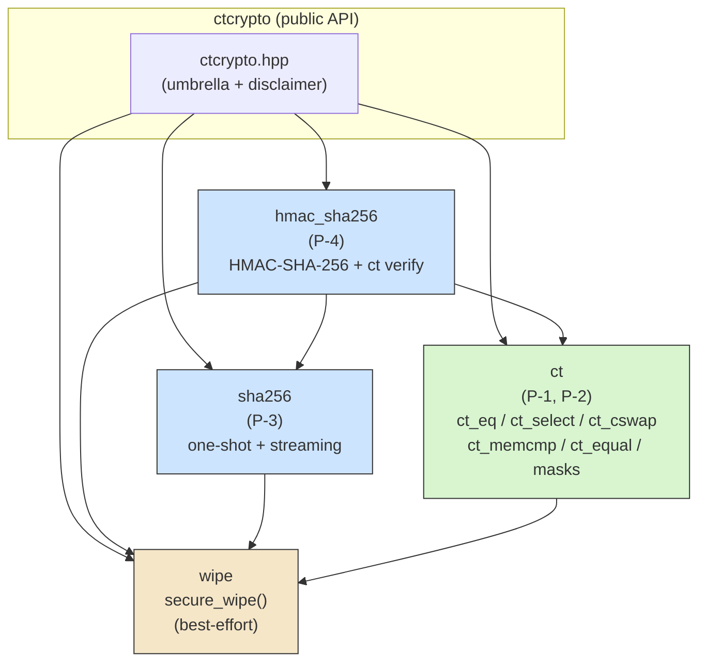

# Design Document Specification — CppCryptoPrimitives

**Status:** Draft v0.1 (Design stage)
**Author:** System Architect
**Date:** 2026-10-02
**Based on:** `docs/requirements/SRS.md` (SRS Draft v0.1) and the frozen PM decisions in
`docs/status.md` (OQ-1…OQ-7).
**License:** MIT

> ⚠️ **Educational — NOT for production.** This library is unaudited and unhardened. The
> disclaimer (FR-13 / NFR-10) must appear in the README and in the umbrella header
> (`include/ctcrypto/ctcrypto.hpp`). This design preserves that constraint.

---

## 0. Binding Constraints (from PM decisions)

These are treated as fixed inputs to the design, not open choices:

| Constraint | Decision |
| --- | --- |
| Language standard | **C++17**, warning-clean under `-Wall -Wextra` on GCC and Clang |
| Build system | **CMake ≥ 3.16** — one reusable library target + one test target |
| Test framework | **GoogleTest** (via `FetchContent`) |
| Platforms | **Linux + GCC/Clang only** for MVP |
| Dependencies | **No third-party crypto** — everything from scratch |
| MVP scope | **P-1…P-4 only** (ct compare, ct select/swap, SHA-256, HMAC-SHA-256) |
| Zeroization | **Best-effort, non-guaranteed** wipe helper, documented |
| CT evidence | Code review + generated-assembly spot-check (no mandatory tooling) |

P-5…P-8 are **out of scope for detailed design**. This document reserves clean extension
points only (Section 8).

---

## 1. Architecture Overview

The library is a small static C++ library under a single namespace, `ctcrypto`, composed of
four cohesive modules. Dependencies flow strictly downward — higher primitives compose lower
ones, never the reverse.



### 1.1 Module responsibilities

| Module | SRS items | Responsibility | Depends on |
| --- | --- | --- | --- |
| **`ct`** | P-1, P-2, FR-1…FR-3, NFR-1…NFR-3 | Branchless building blocks: masks, `ct_eq`, `ct_select`, `ct_cswap`, byte-buffer `ct_memcmp`/`ct_equal`. | `wipe` (optional) |
| **`sha256`** | P-3, FR-4, FR-5 | SHA-256 one-shot + incremental (init/update/finalize). Naturally constant-time (no secret-dependent branch/index). | `wipe` |
| **`hmac_sha256`** | P-4, FR-6, FR-7 | HMAC-SHA-256 one-shot + streaming + **constant-time tag verify** (reuses `ct::ct_equal`). | `sha256`, `ct`, `wipe` |
| **`wipe`** | OQ-7 | Documented best-effort secret zeroization (`secure_wipe`). | — |

### 1.2 How P-1…P-4 compose

- **HMAC-SHA-256 (P-4)** runs SHA-256 (P-3) twice (inner/outer) and verifies tags with the
  constant-time comparison (P-1). This single composition demonstrates every MVP technique
  end-to-end, which is the stated portfolio goal.
- **`secure_wipe`** is called by SHA-256 `finalize`/destructor and by HMAC to clear the
  key pads and internal hash state (best-effort; documented as non-guaranteed).

---

## 2. Repository / Directory Layout

Proposed concrete tree. New files are marked `(new)`; existing files are left in place.

```
CppCryptoPrimitives/
├── CMakeLists.txt                      (new)  root build, library target + options
├── LICENSE
├── README.md                           (new)  must carry the not-for-production disclaimer
├── include/
│   └── ctcrypto/                              public headers (install/consume surface)
│       ├── ctcrypto.hpp                (new)  umbrella header + disclaimer comment
│       ├── ct.hpp                      (new)  P-1/P-2: masks, ct_eq/select/cswap, ct_equal
│       ├── wipe.hpp                    (new)  secure_wipe declaration
│       ├── sha256.hpp                  (new)  P-3: Sha256 class + free functions
│       └── hmac_sha256.hpp             (new)  P-4: HmacSha256 class + verify
├── src/
│   ├── sha256.cpp                      (new)  SHA-256 compression + padding
│   ├── hmac_sha256.cpp                 (new)  key derivation, pads, verify
│   └── wipe.cpp                        (new)  volatile/barrier-based wipe
├── tests/
│   ├── CMakeLists.txt                  (new)  GoogleTest target wiring
│   ├── ct_tests.cpp                    (new)
│   ├── sha256_tests.cpp               (new)
│   ├── hmac_sha256_tests.cpp           (new)
│   └── wipe_tests.cpp                  (new)
└── docs/
    ├── status.md
    ├── requirements/
    │   └── SRS.md
    ├── design/
    │   └── DESIGN.md                   (this file)
    └── side-channel/                   (new)  SCN-1…SCN-3 deliverables
        ├── overview.md                 (new)  project-wide threat model (SCN-3)
        ├── ct_compare.md               (new)  P-1 notes
        ├── ct_select_swap.md           (new)  P-2 notes
        ├── sha256.md                   (new)  P-3 notes
        └── hmac_sha256.md              (new)  P-4 notes
```

### 2.1 Naming & organization conventions

- **Namespace:** `ctcrypto` for the public API. Low-level constant-time helpers live in a
  nested `ctcrypto::ct` namespace to keep names like `select`/`eq` from colliding with
  higher-level concepts. Internal-only helpers go in `namespace detail {}` inside `.cpp`
  files (no external linkage, not in public headers).
- **Headers:** one header per module under `include/ctcrypto/`. The umbrella
  `ctcrypto.hpp` includes all module headers and hosts the disclaimer.
- **Header guards:** `#pragma once` (both supported compilers) plus traditional guard macro
  `CTCRYPTO_<MODULE>_HPP` is acceptable; pick one and apply uniformly (`#pragma once`
  recommended for brevity).
- **File names:** `snake_case.hpp` / `snake_case.cpp`.
- **Types:** `PascalCase` for classes (`Sha256`, `HmacSha256`); `snake_case` for free
  functions (`ct_equal`, `secure_wipe`); `snake_case` for constants
  (`sha256_digest_size`).
- **Byte type:** public buffer APIs use `const unsigned char*` / `unsigned char*` with
  `std::size_t` lengths (not `std::byte`, to keep call sites simple and C++17-portable; the
  developer may add `std::byte`/`void*` overloads if desired, but ptr+len is canonical).
- **No `using namespace` in headers.**

---

## 3. CMake Target Layout

Two targets: the library and the tests. GoogleTest is pulled via `FetchContent` so consumers
need nothing pre-installed (NFR-8, NFR-9).

### 3.1 Root `CMakeLists.txt` (shape, not full code)

```cmake
cmake_minimum_required(VERSION 3.16)
project(ctcrypto LANGUAGES CXX VERSION 0.1.0)

# Only build tests when this is the top-level project (friendly to add_subdirectory).
option(CTCRYPTO_BUILD_TESTS "Build ctcrypto unit tests" ${PROJECT_IS_TOP_LEVEL})

add_library(ctcrypto
    src/sha256.cpp
    src/hmac_sha256.cpp
    src/wipe.cpp)
add_library(ctcrypto::ctcrypto ALIAS ctcrypto)      # canonical linkable name

target_include_directories(ctcrypto PUBLIC
    $<BUILD_INTERFACE:${CMAKE_CURRENT_SOURCE_DIR}/include>)

target_compile_features(ctcrypto PUBLIC cxx_std_17)

# Warning-clean requirement (NFR-4) — apply only to our own target, not consumers.
if (CMAKE_CXX_COMPILER_ID MATCHES "GNU|Clang")
    target_compile_options(ctcrypto PRIVATE -Wall -Wextra)
endif()

if (CTCRYPTO_BUILD_TESTS)
    enable_testing()
    add_subdirectory(tests)
endif()
```

Design notes:
- **Static library** (default `add_library`), not `INTERFACE`/header-only: SHA-256 and HMAC
  carry real `.cpp` translation units. The `ct` helpers and `wipe` declaration are header-
  visible; `wipe`'s definition lives in `wipe.cpp` so the volatile barrier is compiled once.
- `include/` is a `PUBLIC` include dir via generator expression so both the library and
  consumers see headers; `BUILD_INTERFACE` keeps it correct for `add_subdirectory` use.
  (Install/export rules are intentionally omitted — packaging is out of scope per SRS §6.)
- `-Wall -Wextra` is `PRIVATE` so it governs our build without forcing flags on consumers.

### 3.2 `tests/CMakeLists.txt` (shape)

```cmake
include(FetchContent)
FetchContent_Declare(
    googletest
    GIT_REPOSITORY https://github.com/google/googletest.git
    GIT_TAG        v1.15.2)          # pin an exact release tag
set(gtest_force_shared_crt ON CACHE BOOL "" FORCE)
FetchContent_MakeAvailable(googletest)

add_executable(ctcrypto_tests
    ct_tests.cpp
    sha256_tests.cpp
    hmac_sha256_tests.cpp
    wipe_tests.cpp)

target_link_libraries(ctcrypto_tests PRIVATE
    ctcrypto::ctcrypto
    GTest::gtest_main)

include(GoogleTest)
gtest_discover_tests(ctcrypto_tests)
```

### 3.3 Consumer integration

Either of the following works with no manual steps (NFR-9):

```cmake
# A) vendored / submodule
add_subdirectory(third_party/CppCryptoPrimitives)
target_link_libraries(my_app PRIVATE ctcrypto::ctcrypto)

# B) FetchContent
include(FetchContent)
FetchContent_Declare(ctcrypto GIT_REPOSITORY <url> GIT_TAG v0.1.0)
FetchContent_MakeAvailable(ctcrypto)
target_link_libraries(my_app PRIVATE ctcrypto::ctcrypto)
```

Because `CTCRYPTO_BUILD_TESTS` defaults to `PROJECT_IS_TOP_LEVEL`, a consumer pulling the
library in does **not** build GoogleTest or the tests.

---

## 4. Key Public Interfaces

All signatures below are **design contracts**, not implementations. Sizes and the
secret/public classification of each argument are explicit, satisfying FR-8.

Conventions used throughout:
- Buffers are `const unsigned char*` + `std::size_t len`. Lengths are **always public**;
  buffer *contents* may be secret as noted.
- Fixed-size outputs are also offered as `std::array` return overloads for ergonomics.
- All primitive functions are `noexcept` (no allocation in hot paths; no exceptions on the
  constant-time path).

### 4.1 `ct.hpp` — constant-time building blocks (P-1, P-2)

```cpp
namespace ctcrypto::ct {

// A "mask" is an unsigned integer whose bits are either all-zero (0) or all-one (~0).
// We expose helpers templated on an unsigned integer type U (uint8_t/uint16_t/uint32_t/
// uint64_t). The 32-bit mask is the default condition type.
using mask32_t = std::uint32_t;

// --- mask construction (branchless) -------------------------------------------------
// bit must be 0 or 1; returns 0 for 0, all-ones for 1.
template <class U> constexpr U mask_from_bit(U bit) noexcept;

// x == 0  -> all-ones ; x != 0 -> 0      (no branch; uses arithmetic on unsigned)
template <class U> constexpr U is_zero(U x) noexcept;
// x != 0  -> all-ones ; x == 0 -> 0
template <class U> constexpr U is_nonzero(U x) noexcept;

// a == b -> all-ones ; a != b -> 0
template <class U> constexpr U eq(U a, U b) noexcept;     // P-1 scalar form

// --- branchless select / swap (P-2) -------------------------------------------------
// mask must be all-ones or all-zeros. Returns a when mask is all-ones, else b.
template <class U> constexpr U select(U mask, U a, U b) noexcept;

// Swap a and b iff mask is all-ones; leave unchanged iff all-zeros. Branch-free.
template <class U> constexpr void cswap(U mask, U& a, U& b) noexcept;

// --- byte-buffer comparison (P-1) ---------------------------------------------------
// Compares two buffers of equal length `len`. Returns all-ones if every byte matches,
// 0 otherwise. Timing depends ONLY on len (public), never on byte values. Contents of
// a and b are treated as SECRET.
mask32_t memcmp_mask(const unsigned char* a,
                     const unsigned char* b,
                     std::size_t len) noexcept;

// Convenience boolean wrapper. The returned bool is the function's intended PUBLIC
// output (match/no-match); no early exit occurs internally.
bool equal(const unsigned char* a,
           const unsigned char* b,
           std::size_t len) noexcept;

} // namespace ctcrypto::ct
```

Rationale: returning a **mask** from `memcmp_mask` lets callers (e.g. HMAC verify) keep the
result in masked form if they want to fold it into further branchless logic; `equal` is the
friendly boolean form for the common case. Both must accumulate differences with OR and
reduce once at the end (see Section 5).

### 4.2 `wipe.hpp` — best-effort zeroization (OQ-7)

```cpp
namespace ctcrypto {

// Best-effort, NON-GUARANTEED secret zeroization. Writes zero bytes to [data, data+len)
// in a way intended to resist dead-store elimination (volatile access + compiler barrier).
// Limitations (copies in registers/stack spills, swapped pages, etc.) are documented in
// docs/side-channel/overview.md. Not a security guarantee.
void secure_wipe(void* data, std::size_t len) noexcept;

template <class T, std::size_t N>
inline void secure_wipe(std::array<T, N>& a) noexcept {
    secure_wipe(a.data(), a.size() * sizeof(T));
}

} // namespace ctcrypto
```

### 4.3 `sha256.hpp` — SHA-256 (P-3, FR-4/FR-5)

```cpp
namespace ctcrypto {

inline constexpr std::size_t sha256_digest_size = 32; // bytes
inline constexpr std::size_t sha256_block_size  = 64; // bytes

using sha256_digest = std::array<unsigned char, sha256_digest_size>;

// Incremental (streaming) interface — FR-5.
class Sha256 {
public:
    Sha256() noexcept;                 // init to IV
    void reset() noexcept;             // re-init for reuse

    // Absorb `len` message bytes. May be called repeatedly. Message bytes are public in
    // SHA-256 (hash input is not secret-dependent in its control flow), but the engine is
    // written to touch no secret-dependent branch/index regardless.
    void update(const unsigned char* data, std::size_t len) noexcept;

    // Produce the 32-byte digest. After finalize the object must be reset() before reuse.
    void finalize(unsigned char out[sha256_digest_size]) noexcept;
    sha256_digest finalize() noexcept;

    ~Sha256();                         // secure_wipe internal state

    // Movable but not copyable (holds mutable hashing state). Copy would silently
    // duplicate secret-derived state; disallow to avoid accidental leaks.
    Sha256(Sha256&&) noexcept = default;
    Sha256& operator=(Sha256&&) noexcept = default;
    Sha256(const Sha256&) = delete;
    Sha256& operator=(const Sha256&) = delete;

private:
    void compress(const unsigned char block[sha256_block_size]) noexcept;
    std::uint32_t state_[8];                        // H0..H7
    unsigned char buffer_[sha256_block_size];       // partial block
    std::uint64_t total_len_;                       // total message length in bytes
    std::size_t   buffer_len_;                      // bytes currently in buffer_
};

// One-shot interface — FR-4.
sha256_digest sha256(const unsigned char* data, std::size_t len) noexcept;
void          sha256(const unsigned char* data, std::size_t len,
                     unsigned char out[sha256_digest_size]) noexcept;

} // namespace ctcrypto
```

Contracts:
- `update` accepts any `len`, including 0; `data` may be null iff `len == 0`.
- Total input length is bounded only by `std::uint64_t` bit-count math per FIPS 180-4.
- `finalize(out)` requires `out` to point to at least 32 writable bytes.

### 4.4 `hmac_sha256.hpp` — HMAC-SHA-256 (P-4, FR-6/FR-7)

```cpp
namespace ctcrypto {

inline constexpr std::size_t hmac_sha256_tag_size = sha256_digest_size; // 32
using hmac_sha256_tag = std::array<unsigned char, hmac_sha256_tag_size>;

class HmacSha256 {
public:
    // key/key_len: the HMAC key. Key BYTES are SECRET. key_len is public. Any key length
    // is accepted (keys longer than the block are hashed; shorter keys are zero-padded),
    // per RFC 2104.
    HmacSha256(const unsigned char* key, std::size_t key_len) noexcept;
    void reset(const unsigned char* key, std::size_t key_len) noexcept;

    void update(const unsigned char* data, std::size_t len) noexcept; // message bytes
    void finalize(unsigned char out[hmac_sha256_tag_size]) noexcept;
    hmac_sha256_tag finalize() noexcept;

    ~HmacSha256();                      // secure_wipe key pads + inner state

    HmacSha256(HmacSha256&&) noexcept = default;
    HmacSha256& operator=(HmacSha256&&) noexcept = default;
    HmacSha256(const HmacSha256&) = delete;
    HmacSha256& operator=(const HmacSha256&) = delete;

private:
    Sha256        inner_;                              // seeded with ipad
    unsigned char o_key_pad_[sha256_block_size];       // SECRET (key ^ opad)
};

// One-shot tag computation — FR-6.
hmac_sha256_tag hmac_sha256(const unsigned char* key, std::size_t key_len,
                            const unsigned char* msg, std::size_t msg_len) noexcept;
void            hmac_sha256(const unsigned char* key, std::size_t key_len,
                            const unsigned char* msg, std::size_t msg_len,
                            unsigned char out[hmac_sha256_tag_size]) noexcept;

// Constant-time tag verification — FR-7. Recomputes the tag and compares it against
// `expected_tag` using ctcrypto::ct::equal. Returns true iff tag_len == 32 AND the tags
// match. Timing is independent of WHERE a mismatch occurs. `expected_tag` contents are
// treated as secret; tag_len is public.
bool hmac_sha256_verify(const unsigned char* key, std::size_t key_len,
                        const unsigned char* msg, std::size_t msg_len,
                        const unsigned char* expected_tag,
                        std::size_t tag_len) noexcept;

} // namespace ctcrypto
```

Contracts:
- A wrong `tag_len` (≠ 32) returns `false`; this length check is on public data and may be a
  normal branch.
- The value comparison of the 32 tag bytes **must** route through `ct::equal` /
  `ct::memcmp_mask` — never `std::memcmp` or a short-circuit loop (FR-7).

### 4.5 `ctcrypto.hpp` — umbrella

```cpp
#pragma once
// CppCryptoPrimitives — educational, constant-time crypto primitives.
//
// *** NOT FOR PRODUCTION ***  Unaudited, unhardened, best-effort constant time only.
// Use a vetted library (libsodium / BoringSSL / OpenSSL) for real cryptography.  (FR-13)
#include "ctcrypto/ct.hpp"
#include "ctcrypto/wipe.hpp"
#include "ctcrypto/sha256.hpp"
#include "ctcrypto/hmac_sha256.hpp"
```

---

## 5. Constant-Time Implementation Conventions

Project-wide rules the developer **must** follow in every primitive. These operationalize
NFR-1…NFR-3 and the SCN requirements.

### 5.1 Mask-based branchless patterns
- Represent a condition as a full-width **mask**: all-zero (`0`) or all-one (`~U(0)`), not a
  `bool`. Build masks arithmetically, e.g. for `is_zero(x)` on unsigned `U`:
  `((x | (0 - x)) >> (bits-1)) - 1` style idioms — never `x == 0 ? ... : ...` on secret `x`.
- `select(mask, a, b)` must be `b ^ (mask & (a ^ b))`. `cswap` must be built from the same
  identity (`tmp = mask & (a ^ b); a ^= tmp; b ^= tmp;`).
- Buffer comparison must **OR together** per-byte differences into an accumulator and reduce
  to a mask exactly once at the end — no early return on first mismatch.

### 5.2 No secret-dependent branches or indexing (NFR-2, NFR-3)
- Forbidden on secret data: `if`, `?:`, `switch`, `&&`/`||` short-circuit, loops whose bound
  depends on a secret, and array indices derived from secrets.
- Loop bounds depend only on public lengths (e.g. `len`, `block_size`). This is why SHA-256
  message bytes are treated as public (its structure is), while HMAC key/pad bytes and tag
  bytes are the secrets flowing only through masked ops.
- No table lookups indexed by secrets. (SHA-256's constants `K[t]` are indexed by the public
  round counter `t`, which is allowed.)

### 5.3 Keeping the compiler from reintroducing branches
- Prefer arithmetic/bitwise mask code over anything the optimizer may lower to a branch.
- Where a value must not be constant-folded or a branch must not be re-synthesized around a
  secret, apply an **optimization barrier** on GCC/Clang:
  `asm volatile("" : "+r"(value) : : "memory");` Keep these in small, clearly-commented
  helper functions (e.g. a `detail::barrier(U&)`), not scattered inline.
- Do **not** rely on `volatile` for correctness of comparisons; use it only in the wipe path
  (5.4). `volatile` is a timing/ordering hint, not a constant-time guarantee.
- Evidence per OQ-6: the developer documents a generated-assembly spot-check (e.g.
  `-O2 -S`) for `ct::memcmp_mask`, `ct::select`, `ct::cswap`, and `hmac_sha256_verify`,
  confirming no conditional branch on secret operands. This is recorded in the side-channel
  notes, not enforced by tooling.

### 5.4 `secure_wipe` strategy (best-effort, OQ-7)
- Implement with a `volatile`-qualified byte pointer write loop **plus** a compiler memory
  barrier (`asm volatile("" ::: "memory")` on GCC/Clang) to resist dead-store elimination.
- A portable fallback is a `volatile` function-pointer to `std::memset`
  (`static void* (*volatile vmemset)(void*,int,size_t) = std::memset;`).
- `secure_wipe` is called from `Sha256`/`HmacSha256` destructors and `finalize` to clear
  state and key pads. It is explicitly documented as **non-guaranteed** (register/stack
  copies, paging, etc.) in `docs/side-channel/overview.md` (SCN-1.3, SCN-2).

### 5.5 Integer width & overflow conventions
- All constant-time arithmetic uses **unsigned** fixed-width types (`std::uint8_t/16/32/64`)
  so overflow is well-defined (modular) and mask tricks are portable. No signed arithmetic
  on secret data (signed overflow is UB and may compile to a branch).
- SHA-256 word type is `std::uint32_t`; the message length counter is `std::uint64_t` (bit
  length = `total_len_ * 8`, matching FIPS 180-4's 64-bit length field).
- Endianness: SHA-256 is big-endian. Byte↔word conversion must use **explicit shift/mask**
  byte assembly, never `reinterpret_cast`/`memcpy` of a `uint32_t` over raw bytes (which is
  endianness-dependent and may alias-violate).
- `std::size_t` for all buffer lengths; guard the `len == 0` / null-pointer case explicitly
  (this check is on public data, so a normal branch is fine).

---

## 6. Side-Channel Notes Structure (SCN-1…SCN-3)

All notes live under `docs/side-channel/`. One overview plus one file per primitive, so that
each primitive "ships with" its notes (SCN-1).

| File | SRS | Contents |
| --- | --- | --- |
| `overview.md` | SCN-3, SCN-2 | Project-wide threat model; shared assumptions (source-level C++ only, no µ-arch/power/EM/cache guarantees); global "constant time not guaranteed" statement; the shared `secure_wipe` limitation. Referenced by every per-primitive note. |
| `ct_compare.md` | SCN-1 | P-1: masked OR-accumulate comparison; what is secret (buffer contents); limitations; assembly spot-check evidence. |
| `ct_select_swap.md` | SCN-1 | P-2: `select`/`cswap` XOR-mask identity; secret = selected values + mask; limitations; evidence. |
| `sha256.md` | SCN-1 | P-3: why SHA-256 is naturally constant-time (public-structured control flow, `K[t]` indexed by public round); limitations. |
| `hmac_sha256.md` | SCN-1 | P-4: key pads as secrets, wipe usage, constant-time verify via P-1; limitations. |

Each per-primitive note must contain the four SCN-1 subsections: (1) technique(s) used,
(2) what is claimed protected, (3) known limitations / un-mitigated threats, (4) how the CT
property was checked and the limits of that evidence. Each must link back to `overview.md`
for the shared SCN-2 disclaimer rather than restating it.

---

## 7. Testing Approach (design-level only)

GoogleTest, one test file per module. Randomized tests must use a **fixed seed** (NFR-12).
No timing assertions are made (CT evidence is review/assembly per OQ-6, not test-enforced).

| Module | Test categories |
| --- | --- |
| `ct` (P-1/P-2) | **Equivalence/property:** `select`/`cswap` match a plain reference (`mask ? a : b`) across exhaustive small widths and randomized values; `eq`/`is_zero` truth tables. `memcmp_mask`/`equal` vs `std::memcmp` result (value equivalence only). **Edge cases:** `len == 0`, single-byte difference at first/last/middle position, all-equal, all-different. Mask outputs are exactly `0` or `~0`. |
| `sha256` (P-3) | **Known-answer tests (FR-9):** FIPS 180-4 / NIST vectors — empty string, `"abc"`, the 56-byte and 64-byte block-boundary vectors, the long/one-million-`'a'` vector (within test limits). **Streaming equivalence:** one-shot digest == streaming digest for the same input split at many chunk boundaries (0,1,63,64,65…). **Edge cases (FR-10):** empty input, inputs straddling the 55/56/64-byte padding boundaries. |
| `hmac_sha256` (P-4) | **Known-answer tests (FR-9):** RFC 4231 test cases 1–7 (including >block-size keys and truncation-length cases, comparing full 32-byte tags). **Streaming equivalence:** one-shot tag == streaming tag. **Verify (FR-7):** `verify` returns true for the correct tag; false for every single-bit-flipped tag, truncated tag, and wrong `tag_len`. |
| `wipe` | Functional: buffer is all-zero after `secure_wipe` (correctness only; non-elimination cannot be unit-tested and is documented instead). |

Negative/edge-case coverage (FR-10) is required for every primitive as noted above.

---

## 8. Extension Points (P-5…P-8 — reserved, not designed now)

The MVP is structured so later stretch work plugs in without reworking P-1…P-4:

- **New module headers** drop into `include/ctcrypto/` (e.g. `aes.hpp` for P-5/P-7,
  `field.hpp` for P-6) and new `.cpp` files add to the `ctcrypto` library target's source
  list — no changes to existing modules.
- **Reusable CT primitives:** bitsliced AES (P-5) and the toy SPN (P-7) consume
  `ct::select`/`ct::cswap`/masks for S-box-free substitution; modular arithmetic (P-6) will
  need additional masked comparators. Reserve space for `ct::lt(U,U)` / `ct::gt(U,U)` /
  `ct::add_with_carry` in `ct.hpp` as future additions (declared only when P-6 is taken on).
- **Umbrella header:** new modules are added to `ctcrypto.hpp` includes when implemented.
- **Side-channel notes & tests:** each new primitive follows the same per-file convention in
  `docs/side-channel/` and `tests/`, so the pattern scales.
- **No API break:** the public MVP signatures in Section 4 are self-contained; stretch work
  only *adds* symbols.

These are extension points only — per the frozen scope, **no P-5…P-8 interfaces are designed
in this document.**

---

## 9. Risks, Design Decisions & Trade-offs

| # | Decision | Alternatives | Rationale / trade-off |
| --- | --- | --- | --- |
| D-1 | **Static library** (`add_library`) with real `.cpp` for SHA-256/HMAC/wipe. | Header-only / `INTERFACE` lib. | Header-only would inline the wipe barrier into every TU and bloat compile units; a compiled `wipe.cpp` gives one authoritative barrier. Trade-off: consumers link a target rather than just including headers — acceptable and idiomatic with the `ctcrypto::ctcrypto` alias. |
| D-2 | **`ptr + size_t` byte API** (`const unsigned char*`). | `std::span` / `std::byte` (C++17 has no `span`). | C++17 baseline lacks `std::span`; ptr+len is portable, zero-dependency, and matches crypto-API convention. Trade-off: slightly less type-safe call sites; mitigated by `std::array` return overloads and clear length contracts. |
| D-3 | **Mask-returning `memcmp_mask` + bool `equal`.** | Only return `bool`. | Letting HMAC verify keep the result as a mask avoids a premature boolean branch and composes cleanly. Trade-off: two entry points to document. |
| D-4 | **`ct` helpers templated & header-inline.** | Out-of-line in a `.cpp`. | Inlining lets the optimizer see the branchless idioms and is required for `constexpr`. Risk: an aggressive optimizer could re-synthesize a branch — mitigated by the barrier helper (5.3) and mandated assembly spot-check (OQ-6). |
| D-5 | **`Sha256`/`HmacSha256` move-only.** | Copyable value types. | Copying mutable, secret-derived hashing state risks silent secret duplication and double-wipe confusion. Move-only is safer; trade-off: callers can't copy a partially-updated hasher (rarely needed). |
| D-6 | **`secure_wipe` documented best-effort.** | Omit, or claim guaranteed wipe. | OQ-7 mandates inclusion with honest limitations. We cannot guarantee erasure at the C++ source level; the risk is a reviewer over-reading it — mitigated by explicit SCN-2 wording in `overview.md` and the header comment. |
| D-7 | **GoogleTest via FetchContent, pinned tag.** | System/`find_package` GoogleTest; Catch2. | PM fixed GoogleTest; FetchContent gives zero-setup builds (NFR-9) and reproducibility via a pinned tag. Risk: network needed on first configure — acceptable for a portfolio project; a pinned tag keeps it deterministic. |
| D-8 | **No install/export rules.** | Full CMake install + `find_package` config. | Packaging/ABI stability is out of scope (SRS §6). `add_subdirectory`/`FetchContent` satisfy NFR-9. Revisit only if distribution becomes a goal. |
| R-1 (risk) | **Compiler may reintroduce branches / eliminate wipes** across compiler and `-O` level. | — | Inherent to source-level C++ (C-4, SCN-2). Mitigation: barrier helpers, assembly spot-check, and honest documentation. Not eliminable; disclosed as a known limitation. |
| R-2 (risk) | **Endianness/aliasing bugs in SHA-256 byte↔word conversion.** | — | Mitigated by mandating explicit shift/mask byte assembly (5.5) and block-boundary KAT vectors (§7). |

### 9.1 Requirement-to-design traceability (MVP)

| Requirement | Covered by |
| --- | --- |
| FR-1 | `ct::memcmp_mask` / `ct::equal` (4.1), conventions 5.1 |
| FR-2 | `ct::select` (4.1) |
| FR-3 | `ct::cswap` (4.1) |
| FR-4 | `sha256(...)` one-shot (4.3) |
| FR-5 | `Sha256` init/update/finalize (4.3) |
| FR-6 | `hmac_sha256(...)` (4.4) |
| FR-7 | `hmac_sha256_verify` via `ct::equal` (4.4) |
| FR-8 | Section 4 (all sizes/preconditions specified) |
| FR-9 / FR-10 | Testing approach (§7) |
| FR-13 | `ctcrypto.hpp` disclaimer + README (4.5, §0) |
| NFR-1…NFR-3 | Constant-time conventions (§5) |
| NFR-4 | C++17 + `-Wall -Wextra` (§3.1) |
| NFR-5 | Library + test targets (§3) |
| NFR-6 | GoogleTest FetchContent (§3.2) |
| NFR-7 | Linux GCC/Clang (§0, §3.1) |
| NFR-8 / NFR-9 | No crypto deps; `add_subdirectory`/`FetchContent` (§3.3) |
| NFR-10 | Disclaimer + side-channel honesty (§0, §6) |
| NFR-11 | Readable branchless patterns mandated (§5) |
| NFR-12 | Fixed-seed randomized tests (§7) |
| SCN-1…SCN-3 | Side-channel notes structure (§6) |
| OQ-7 | `secure_wipe` (4.2, 5.4) |

### 9.2 Flag back to Requirements Analyst
No new requirements were uncovered; the design fits the existing SRS. **No scope expansion
beyond P-1…P-4 is proposed.** One observation for the record: SRS FR-8 says "each primitive"
exposes documented sizes/preconditions — `secure_wipe` is a helper, not a primitive, but is
documented here anyway for completeness. No action required.

---

## 10. Handoff

**Design is ready for the C++ Developer agent to implement.**

### Module list (build in dependency order)
1. **`wipe`** — `include/ctcrypto/wipe.hpp`, `src/wipe.cpp`
2. **`ct`** — `include/ctcrypto/ct.hpp` (header-only, templated/inline)
3. **`sha256`** — `include/ctcrypto/sha256.hpp`, `src/sha256.cpp`
4. **`hmac_sha256`** — `include/ctcrypto/hmac_sha256.hpp`, `src/hmac_sha256.cpp`
5. **`ctcrypto.hpp`** umbrella header (disclaimer)
6. Build: root `CMakeLists.txt` + `tests/CMakeLists.txt`
7. Docs: `docs/side-channel/overview.md` + four per-primitive notes; README with disclaimer

### Public API surface summary
- `ctcrypto::ct`: `mask_from_bit`, `is_zero`, `is_nonzero`, `eq`, `select`, `cswap`
  (templated on unsigned `U`); `memcmp_mask(ptr,ptr,len) -> mask32_t`;
  `equal(ptr,ptr,len) -> bool`.
- `ctcrypto`: `secure_wipe(void*,size_t)` (+ `std::array` overload).
- `ctcrypto`: `class Sha256 { reset / update / finalize }`; `sha256(...)` one-shot (array +
  out-buffer forms); `sha256_digest`, `sha256_digest_size = 32`, `sha256_block_size = 64`.
- `ctcrypto`: `class HmacSha256 { reset / update / finalize }`; `hmac_sha256(...)` one-shot;
  `hmac_sha256_verify(...) -> bool`; `hmac_sha256_tag`, `hmac_sha256_tag_size = 32`.

### What the C++ Developer must be careful about
1. **No secret-dependent branch/index/`?:`/short-circuit** anywhere in `ct`, `sha256`
   (engine), and `hmac` — only loop on **public** lengths (§5.2).
2. **`hmac_sha256_verify` must compare via `ct::equal`/`memcmp_mask`** — never `std::memcmp`
   or a loop with early return (FR-7). The `tag_len != 32` check is public and may branch.
3. **`ct::select`/`cswap` must use the XOR-mask identity** (`b ^ (mask & (a^b))`), and masks
   are full-width `0`/`~0`, not `bool` (§5.1).
4. **SHA-256 byte↔word conversion via explicit shift/mask** (big-endian), never
   `reinterpret_cast`/`memcpy` of `uint32_t` over bytes; use `uint64_t` for the length
   counter (§5.5). Validate against block-boundary KAT vectors.
5. **Use unsigned fixed-width types for all secret arithmetic**; signed overflow is UB and
   may compile to a branch (§5.5).
6. **Apply the `asm volatile` compiler barrier** only in `secure_wipe` and the few spots
   where the optimizer might re-synthesize a branch; keep them in small commented helpers
   (§5.3). Document a `-O2 -S` assembly spot-check in the side-channel notes (OQ-6).
7. **`secure_wipe` is best-effort and must be documented as non-guaranteed** — call it from
   `Sha256`/`HmacSha256` destructors and `finalize`; do not claim it erases all copies.
8. **Hashers are move-only** — do not add copy semantics.
9. **Warning-clean under `-Wall -Wextra` on both GCC and Clang** before stage sign-off
   (NFR-4).
10. **Carry the not-for-production disclaimer** in both `ctcrypto.hpp` and the README
    (FR-13). Do **not** design or implement P-5…P-8 — MVP is frozen at P-1…P-4.
```
